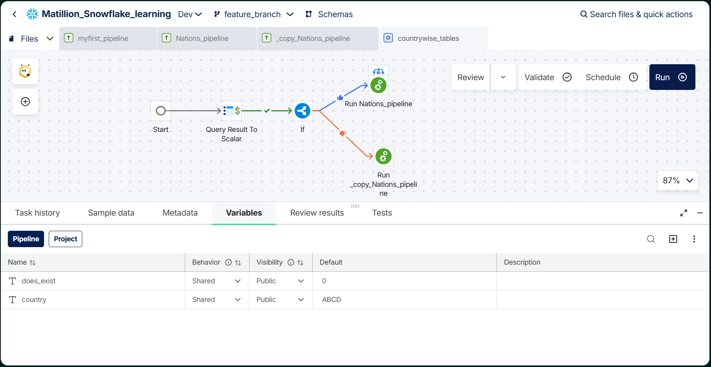
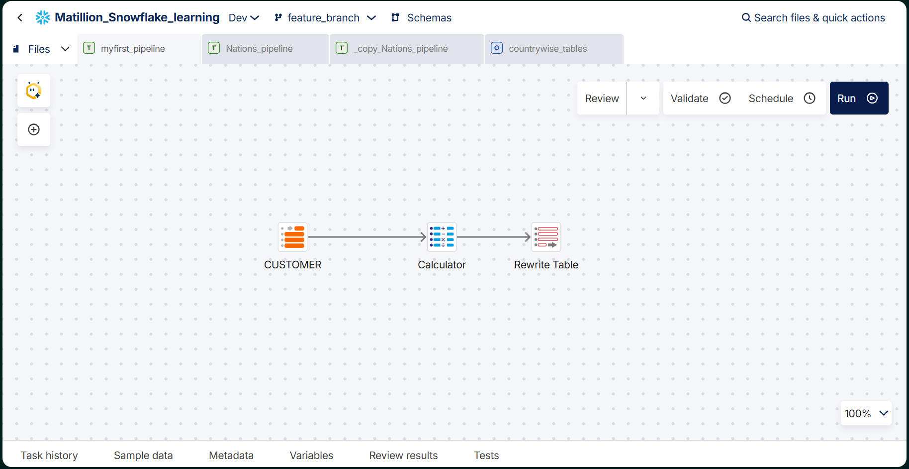
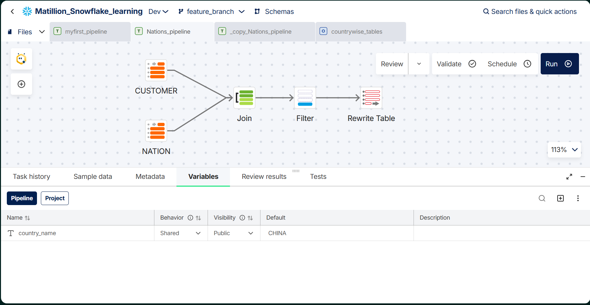

# Matillion + Snowflake Learning Project

Hands-on project where I learned to build ETL/ELT pipelines in **Matillion Data Productivity Cloud**, loading and transforming data in **Snowflake**.

## Goals

- Learn the Matillion Designer: transformation and orchestration pipelines
- Practice parameterizing pipelines with variables
- Add conditional logic to orchestration (run different pipelines depending on a query result)
- Work with Git branches (`main` and `feature_branch`) inside Matillion

## Tech Stack

| Area | Tool |
|---|---|
| ETL / orchestration | Matillion (Full SaaS runner, Maia Hosted Git) |
| Data platform | Snowflake |
| Source data | `SNOWFLAKE_SAMPLE_DATA.TPCH_SF1` (CUSTOMER, NATION) |
| Target | `MATILLION_LEARNING.BRONZE` schema |
| Version control | Git (branches: `main`, `feature_branch`) |

## Pipelines

### 1. `myfirst_pipeline` (transformation)
`CUSTOMER` → `Calculator` → `Rewrite Table`

Reads the CUSTOMER table, adds audit columns (load date and user) with a Calculator, and writes the result with Rewrite Table.

### 2. `Nations_pipeline` (transformation)
`CUSTOMER` + `NATION` → `Join` → `Filter` → `Rewrite Table`

Joins customers to nations on `nationkey`, filters by the pipeline variable `country_name` (default: `CHINA`), and writes a country-specific table.

### 3. Orchestration pipeline
`Start` → `Query Result To Scalar` → `If` → `Run Nations_pipeline` / `Run _copy_Nations_pipeline`

Checks whether a table for the given country already exists (querying `INFORMATION_SCHEMA.TABLES`), stores the result in the `does_exist` variable, then branches with an `If` component to run the appropriate pipeline.

## Variables

| Variable | Scope | Default | Purpose |
|---|---|---|---|
| `country_name` | Pipeline | `CHINA` | Country filter in the Nations pipeline |
| `country` | Pipeline | `ABCD` | Country passed in the orchestration pipeline |
| `does_exist` | Pipeline | `0` | Flag: does the country table already exist? |

## SQL Used

Supporting Snowflake queries are in [`/sql`](sql/), including:
- Join of CUSTOMER and NATION filtered by country
- Existence check using `INFORMATION_SCHEMA.TABLES`
- Table create/drop statements used while testing

## How to Run

1. Create a Snowflake database `MATILLION_LEARNING` with a `BRONZE` schema and a warehouse.
2. Create a Matillion project connected to Snowflake and import the files from `/pipelines`.
3. Set the environment (I used `Dev`) and confirm the default database/schema.
4. Run the orchestration pipeline and change the `country` variable to test branching.

## Key Learnings

- Transformation pipelines handle data logic; orchestration pipelines control flow and dependencies
- Variables make pipelines reusable instead of hardcoding values
- `Query Result To Scalar` + `If` enables conditional execution
- Feature branches keep experiments separate from `main`

## Next Steps

- [ ] Load data from Amazon S3 using the Copy Into approach
- [ ] Add scheduling for the orchestration pipeline
- [ ] Add data quality tests
- [ ] Build Bronze → Silver → Gold layers

## Notes

No credentials or account details are stored in this repository.
